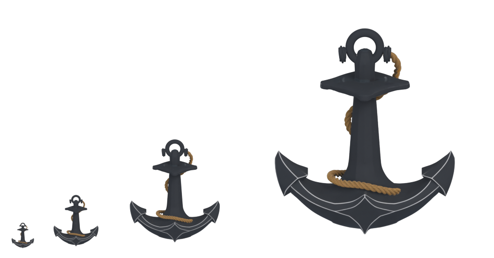

# Puffbox

Pre-rendered 3D assets in the chunky 90s CGI / CD-ROM kid-game aesthetic. Type a word or pass a `.glb`; Blender does the rest.

<p align="center">
  
  &nbsp;&nbsp;
  
</p>

<p align="center">
  
  <br>
  <em>One model, four sizes via <code>puffbox resume &lt;id&gt; --size N</code>.</em>
</p>

## Install

Needs Python 3.10+ and Blender 4.0+ on `$PATH` (or set `$BLENDER_BIN`).

```bash
pip install -e .
```

## Commands

```bash
puffbox text "Aerdash"                            # puffy 3D text → PNG
puffbox text "Start" --frames 12 --edit           # opens Blender, renders on close
puffbox model thing.glb --spin --frames 12        # spinning sprite sheet of any model
puffbox meshy "a cartoon mushroom" --spin         # text-to-3D via Meshy (needs MESHY_API_KEY)

puffbox list                                      # session history
puffbox resume <id> --size 128 --output a.png     # re-render any past session
```

| flag | what |
|---|---|
| `--frames N` | sprite sheet length / pre-stretched timeline in `--edit` |
| `--size N` | render resolution (px) |
| `--output PATH` | output PNG path |
| `--spin` | auto 360° spin → sprite sheet |
| `--edit` | open Blender GUI, render after you save and close |
| `--axis X\|Y\|Z`, `--angle N`, `--saturation`, `--brightness` | tweaks |

`--edit` opens Blender already in camera view with the timeline pre-set to `--frames`. Save and close — Puffbox auto-renders. If you keyframed an animation, you get a sprite sheet; if not, a single PNG. Output type is decided by what you built, not a flag.

Sessions are saved under `~/.puffbox/sessions/<id>/` (`scene.blend` + frames + `manifest.json`). `puffbox list` finds them, `puffbox resume <id>` re-renders — pass `--size` / `--frames` / `--output` to remix.

Material and lighting tunables: top of `puffbox/blender_scripts/build_text.py` and `render_sprite.py`.

## License

MIT.
